[feedline.kr](https://feedline.kr) &nbsp;·&nbsp;
[solved.ac](https://solved.ac/wkdgns720)

> 서울에서 서비스 만드는 개발자예요. 
> 여기저기 흩어져 있는 정보를 한곳에 모아 쓸 만하게 만드는 일을 좋아합니다.

<samp>2026.05 &#8211; present &nbsp;&nbsp; Shopinx &nbsp;·&nbsp; 서비스 개발</samp> 
<samp>2025.06 &#8211; 2025.12 &nbsp;&nbsp; Newtonz &nbsp;·&nbsp; 개발 총괄</samp> 
<samp>2025.03 &#8211; present &nbsp;&nbsp; 42Seoul &nbsp;·&nbsp; member</samp> 
<samp>2023.09 &#8211; 2025.03 &nbsp;&nbsp; 42Seoul &nbsp;·&nbsp; learner (École 42)</samp>

**[FeedLine](https://feedline.kr)** &nbsp;·&nbsp; <samp>typescript, cloudflare workers, d1</samp> 
마케팅 소식이 검색, 광고, 소셜, 뉴스레터로 뿔뿔이 흩어져 있는 게 늘 
불편했어요. 그래서 직접 만든 개인용 정보 허브입니다. 67개 소스를 15분마다 
훑어서 중복을 걷어내고, AI로 분석하고 번역한 다음, 지금 읽을 만한 것만 
골라서 브리핑으로 보여줍니다. 어떤 소스가 조용해지면 그것도 알려주고요.

**[YenWatch](https://github.com/OnePaperHoon/RateBot)** &nbsp;·&nbsp; <samp>typescript, raspberry pi</samp> 
라즈베리파이에 올려두고 24시간 돌리는 엔화 환율 봇이에요. 처음엔 매분 새 
메시지를 보냈는데 채널이 알림으로 도배돼서 오히려 안 보게 되더라고요. 
그래서 메시지 하나만 만들어 두고 그것만 계속 고쳐 쓰는 방식으로 바꿨습니다. 
알림도 환율이 기준선을 넘는 순간에만 한 번 갑니다.

**[ClaudeCodeAlert](https://github.com/OnePaperHoon/ClaudeCodeAlert)** &nbsp;·&nbsp;
**[CodexAlert](https://github.com/OnePaperHoon/CodexAlert)** &nbsp;·&nbsp; <samp>typescript</samp> 
긴 작업 걸어두고 딴짓하다가 끝난 걸 놓치는 일이 잦아서 만든 CLI 알림 
라이브러리 두 개예요.

